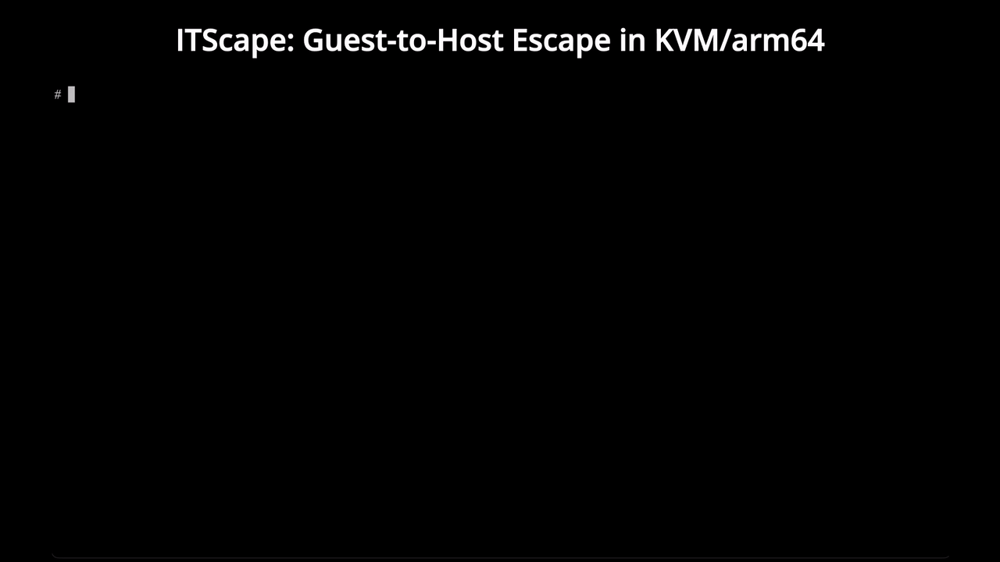

# ITScape: Guest-to-Host Escape in KVM/arm64

<p align="center">
  
</p>

# Abstract



This document describes the ITScape (CVE-2026-46316) vulnerability reported and patched by [Hyunwoo Kim (@v4bel)](https://x.com/v4bel). It is a KVM escape vulnerability that lets a guest escape to the host in a KVM/arm64 environment and run commands on the host with kernel (root) privilege. To the best of public knowledge, this is the first guest-to-host escape exploit research targeting KVM/arm64.

ITScape exploits a race condition in the vGIC-ITS (Interrupt Translation Service) emulation of KVM/arm64. It triggers the bug with guest-side actions alone to escape to the host, and it can threaten the guest-host isolation of KVM/arm64 hosts that accept untrusted guests, particularly multi-tenant arm64 public clouds.

Unlike the commonly published QEMU escapes, the bug lives in in-kernel KVM rather than QEMU user-space, so it works independently of QEMU's emulation, and it can run commands on the host with host kernel privilege rather than the privilege of a user process (such as QEMU).

For the detailed technical information, [see here](assets/write-up.md).

> [!NOTE]
> After reporting this vulnerability to linux-distros@vs.openwall.org, the agreed embargo has ended, so this ITScape document is now published. For the disclosure timeline, see the technical detail document.


# PoC Structure

For safe testing, running the PoC under QEMU TCG is recommended. (Triggering the vulnerability has nothing to do with QEMU.) When run under QEMU TCG, the PoC has the following structure.

```
QEMU TCG: emulates an arm64 CPU (including EL2) so an arm64 kernel runs as the KVM host
   └─ arm64 Host Kernel: the KVM host and the escape target
        └─ poc: opens the HOST's /dev/kvm and creates one guest VM "G" (uid=1000)
             └─ 1. G's guest code (run by poc via KVM_RUN) performs GIC/ITS MMIO
                2. traps into the HOST's in-kernel KVM -> double-put -> HOST kernel code-exec
```

This PoC is not a fully weaponized exploit that runs immediately in an arm64 cloud environment, but demonstration code that reproduces the vulnerability and the full exploit chain on top of a kvm selftest. An attacker who knows the target cloud's virtualization stack implementation is expected to find the transition to weaponization itself not difficult, but it entails porting the selftest's host-side direct construction to a real guest-driven path and tuning the addresses, gadget, offsets, race timing, and so on to the target kernel version and config. A weaponized real-world exploit exists but is not being released.


# PoC Usage

1. The PoC is built on top of the kvm selftest in the Linux kernel source. Download the [v7.1-rc6 kernel source](https://github.com/torvalds/linux/releases/tag/v7.1-rc6), the version right before the vulnerability was patched, then build the PoC with the build script. Then build the kernel image with the bundled kconfig.
```sh
# ./build.sh <linux>/tools/testing/selftests/kvm
```

2. Put the built PoC into a suitable initramfs, then run qemu based on the attached QEMU script.
```sh
# ./qemu.sh <kernel-image> <initramfs>
```

3. After QEMU TCG boots, run poc. On a successful exploit, it escapes the guest and creates the /ITScape file on the host.
```sh
# ./poc
...
[+] /ITScape created by the host kernel (owner uid=0). verify:  ls -la /ITScape
# ls -la /ITScape
-rw-r--r--    1 0        0                0 Jun  9 00:02 /ITScape
```

This PoC is intended to provide accurate information. Do not use it on systems you are not authorized to test.


# Affected Versions

ITScape (CVE-2026-46316) covers the range from [8201d1028caa (2024-04-25)](https://git.kernel.org/pub/scm/linux/kernel/git/torvalds/linux.git/commit/?id=8201d1028caa) to [13031fb6b835 (2026-06-05)](https://git.kernel.org/pub/scm/linux/kernel/git/torvalds/linux.git/commit/?id=13031fb6b835).


# FAQ

## Should I be worried?

If you operate an arm64 KVM host that accepts multi-tenant guests, or use an instance on top of one, check that the 13031fb6b835 patch is applied to the host kernel (operators directly, tenants through their provider). Also, since this is a new vulnerability class, more variants and follow-up vulnerabilities are expected, so keep watch. That said, you will need to distinguish whether a follow-up vulnerability is really triggerable by guest actions alone without host-side action, and whether it is in fact exploitable.

## Does this affect x86 or other architectures?

No. The vulnerability is in arch/arm64/kvm/vgic/. If you are not on an arm64 KVM host, you do not need to worry about this vulnerability.

## Do I need root inside the guest VM?

Yes. Driving GIC/ITS MMIO requires guest kernel (EL1) privilege. When you are allocated an instance on a public cloud you usually have root on your own VM, so this is satisfied. In a scenario without guest root, it must be chained with an LPE such as [Dirty Frag](https://github.com/V4bel/dirtyfrag).
